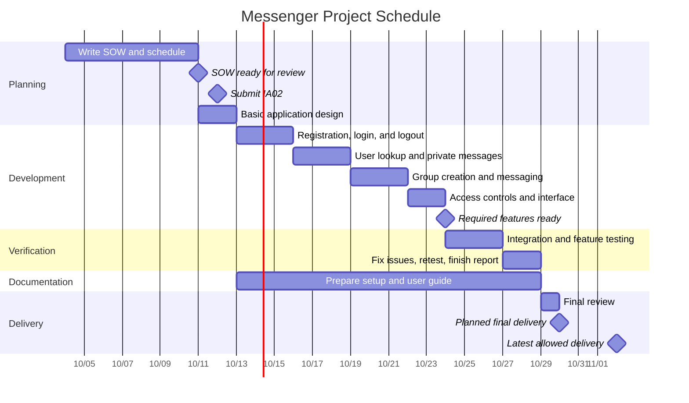

# Messenger — Statement of Work

Course: CPS 490 — Capstone I

Assignment: IA 02 — Messenger: Statement of Work

## 1. Project Purpose and Objectives

#### 1.1 Purpose

Messenger is an application that lets registered users send private messages to each other and chat in groups 

For the first version, I plan to implement basic features such as account registration and login, private messaging, and group chat.

Consider advanced features such as viewing message history and message search.

#### 1.2 Objectives

- Allow users to create an account and log in.

- Allow registered users to send and receive private text messages.

- Allow users to exchange text messages in a group.

- Allow users to view earlier messages in their conversations.

- Keep conversations accessible only to the users who are part of them.

## 2. Stakeholders

#### 2.1 Client in the Assignment Scenario

The client wants a messaging application that supports private messages and group chat. The client's stated needs guide the project scope. Any unclear requirements will be listed as questions or assumptions.

#### 2.2 Intended Users

The intended users are people who register for Messenger to communicate with others. They need to send and receive messages easily and access only the conversations they are part of.

#### 2.3 Student Developer

I am responsible for planning, building, testing, and documenting the application. I need to keep the project manageable and prepare the agreed work for delivery by the deadline.

#### 2.4 Course Instructor

The course instructor provides the assignment requirements and evaluates the submitted work. The instructor checks whether the statement of work is clear, realistic, and consistent with the assignment.

## 3. Scope

#### 3.1 In Scope

The first version of Messenger will include the following features:

- Account registration, login, and logout.

- Private text messaging between two registered users. Users can find another user by their username and start a conversation.

- Basic group chat. Users can create a named group, add registered users, and leave a group. Group members can send and receive text messages within the group.

- Conversation access control. Only the two participants can access a private conversation. Only current group members can access a group conversation.

- A basic interface for opening conversations, reading incoming messages, and sending new messages.

#### 3.2 Out of Scope

If time permits, include these additional features. These features are not part of the committed deliverables for the first version, nor are they mandatory acceptance criteria.

- Voice calls, video calls, and screen sharing.

- Sending images, videos, or other file attachments.

- Message editing, message deletion, and emoji reactions.

## 4. Deliverables

#### 4.1 Working Application and Source Code

A working version of Messenger with the required features listed in Section 3.1. The source code and files needed to run the application will be stored in the course GitHub repository.

#### 4.2 Test Report

A test report showing how the required features were checked. It will include the test steps, expected results, actual results, and whether each test passed or failed. Any known problems will also be listed.

#### 4.3 Setup and User Guide

A short guide explaining how to set up and run Messenger. It will also explain how to create an account, log in and out, start a private conversation, and create, use, and leave a group.

## 5. Assumptions, Constraints, and Dependencies

#### 5.1 Assumptions

The following assumptions are used for planning and still need confirmation:

- The first version will be used by a small group for testing and demonstration.

- Users will have a supported device and a network connection.

- The person creating a group can add registered users directly. The first version will not require an invitation and approval process.

If an assumption is incorrect, I will review its effect on the scope and schedule and update the plan.

#### 5.2 Constraints

- The completed Messenger application must be ready for final delivery no later than November 2, 2026.

- The schedule must leave time for integration, testing, fixes, and final review before delivery.

- The IA02 document and supporting files must be committed and pushed to the individual course GitHub repository by October 12, 2026.

- The application must allow registered users to exchange private messages and participate in group chats.

- Optional features must not delay the required features or the planned delivery.

#### 5.3 Dependencies

- The project needs access to the course GitHub repository to store and submit the work.

- Development and testing need the required software tools and libraries to be available. These will be listed in the setup guide.

- Testing needs multiple test accounts and an environment where users can connect at the same time.

- Questions about unclear course requirements need clarification from the instructor. Until they are answered, any related assumptions will be documented.

## 6. Milestones and Schedule

#### 6.1 Planning Assumptions

- This schedule assumes that I can work on the project regularly throughout the week.

- The dates are planned targets, not a record of completed work.

- Required features will be developed first. Optional features are not included in this schedule.

- Setup and usage instructions will be written during development and finished before the final review.

- The planned delivery date is October 30, 2026. October 31 through November 2 is reserved for unexpected problems.

#### 6.2 Major Milestones

- October 11: Complete the statement of work and Gantt chart for review.

- October 12: Commit and push the IA02 document and supporting files.

- October 13: Complete the basic application design.

- October 24: Have all required features ready for integration and testing.

- October 29: Complete testing, required fixes, the test report, and the setup and user guide.

- October 30: Complete the final review and deliver the application, source code, and documents.

- November 2: Latest allowed final delivery date.

#### 6.3 Gantt Chart

The chart below shows the planned work and its order. Task durations use calendar days, including weekends. Milestones mark when the preceding work should be ready.

#### 6.4 Dependencies and Readiness

- Account access must work before private messaging can be tested with registered users.

- Group messaging builds on the basic messaging work.

- Integration and full feature testing begin after the required features are ready.

- Testing will cover account access, private messages, group membership, group messages, and attempts to access conversations without permission.

- The final review depends on completing the required fixes, test report, and setup and user guide.

- Delivery will include the working application, source code, test report, and instructions. Any remaining limitations will be documented.